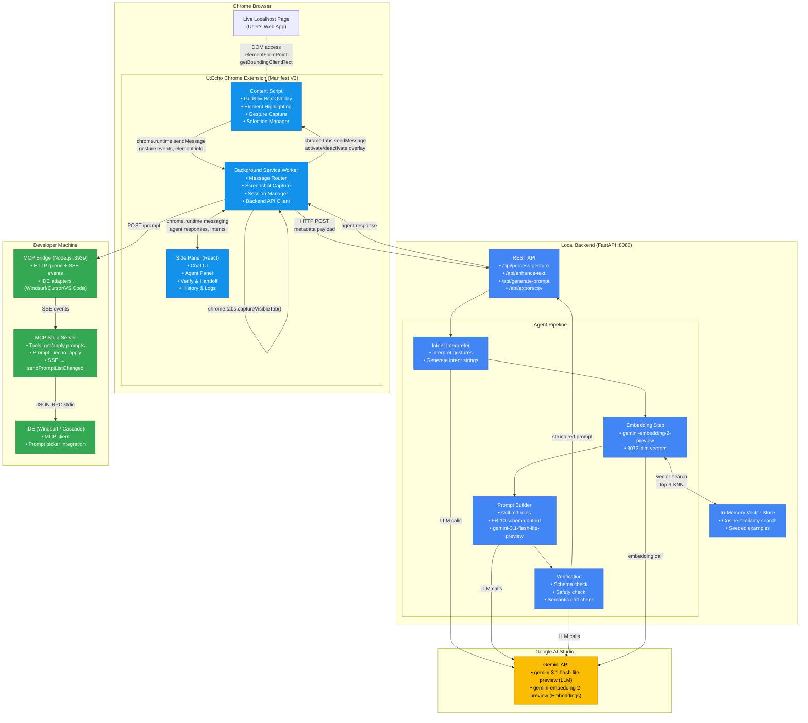

# U:Echo — Architecture Diagram

## Data Flow Summary

1. **Gesture Capture:** Content script detects user interaction → packages gesture metadata
2. **Screenshot:** Service worker calls `chrome.tabs.captureVisibleTab()` → base64 PNG
3. **Intent Interpretation:** Backend agent interprets gesture → generates plain-English intent
4. **Auto-Populate:** Intent string returns to side panel chat field
5. **Embedding:** `gemini-embedding-2-preview` creates 3072-dim vector from intent text
6. **Vector Search:** In-memory cosine similarity search returns top-3 similar example prompts
7. **Prompt Builder:** `gemini-3.1-flash-lite-preview` generates FR-10 structured prompt
8. **Verification:** Schema + safety + semantic drift check (cosine sim ≥ 0.80)
9. **IDE Delivery:** Confirmed prompt POSTed to MCP bridge → SSE notifies MCP stdio server → prompt appears in Cascade via MCP protocol
