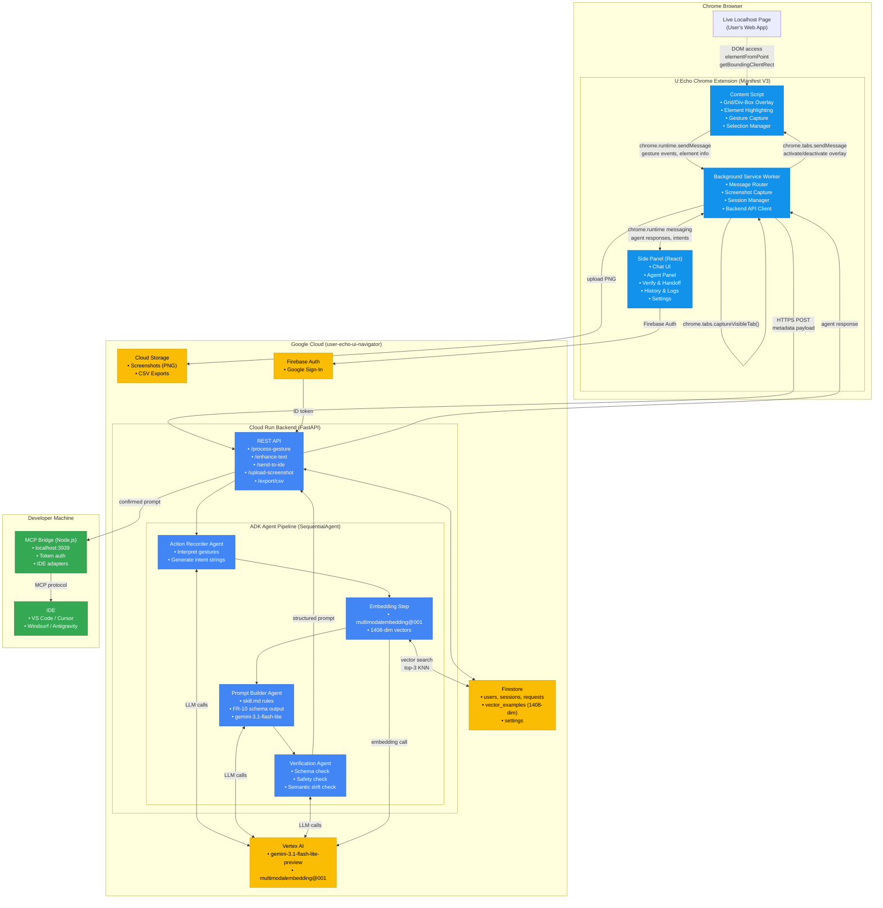

# U:Echo — Architecture Diagram

## Data Flow Summary

1. **Gesture Capture:** Content script detects user interaction → packages gesture metadata
2. **Screenshot:** Service worker calls `chrome.tabs.captureVisibleTab()` → uploads to Cloud Storage
3. **Action Recorder:** Backend agent interprets gesture → generates plain-English intent
4. **Auto-Populate:** Intent string returns to side panel chat field
5. **Embedding:** `multimodalembedding@001` creates 1408-dim joint vector from screenshot + intent
6. **Vector Search:** Firestore KNN query returns top-3 similar example prompts
7. **Prompt Builder:** Gemini 3.1 Flash-Lite generates FR-10 structured prompt
8. **Verification:** Schema + safety + semantic drift check (cosine sim ≥ 0.80)
9. **IDE Delivery:** Confirmed prompt sent via MCP bridge to developer's IDE
